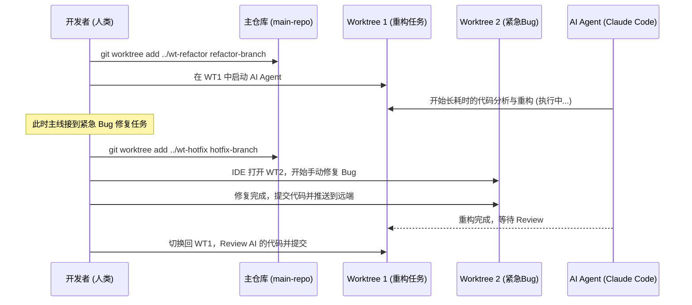

## 一、 引言

在现代软件开发中，我们经常面临这样的场景：正在开发一个复杂的新功能，突然线上爆出一个高优先级的 Bug 需要立即修复，或者需要帮同事 Code Review 并运行另外一个分支的代码。传统的 `git stash` 或频繁的 `git checkout` 往往会导致上下文丢失、依赖重新安装（如 `node_modules` 噩梦）以及编译缓存失效。

随着 Claude Code、Codex CLI 等 AI 编程 Agent 工具的崛起，开发者越来越多地将编码任务“外包”给 AI。但是，如果你只有一个本地工作目录，AI Agent 在执行长耗时的重构或生成任务时，你只能被迫等待，无法在同一个项目中并行推进其他工作。

这时，**Git Worktree** 成为了破局的关键。本文将深度剖析 Git Worktree 的核心原理，并展示如何将其与 AI Agent 结合，打造真正的“并行开发工作流”。

---

## 二、 正文：核心概念与原理解析

### 1. Git Worktree 的核心概念与工作原理

Git Worktree 是 Git 2.5 版本引入的强大特性。它允许你将同一个 Git 仓库检出到多个不同的本地目录中。
- **单仓库，多实体**：所有 Worktree 共享同一个 `.git` 历史数据（如 commits、branches、tags），但拥有独立的暂存区（Index）、工作目录（Working Directory）和 HEAD 指针。
- **底层原理**：当你创建一个新的 Worktree 时，Git 会在主仓库的 `.git/worktrees/` 目录下创建一个与新树同名的子目录，其中包含该树专属的 `HEAD`、`index` 等元数据。而在新的工作目录中，Git 会放置一个 `.git` **文件**（而不是文件夹），其内容是一个指向主仓库对应元数据目录的绝对路径。

### 2. 对比传统分支切换方式的优劣

| 维度 | 传统 `git checkout` / `git switch` | `git worktree` |
| :--- | :--- | :--- |
| **上下文切换** | 需清理工作区，保存 stash，易遗漏 | 目录级隔离，零切换成本，完全保留现场 |
| **依赖与构建** | 切换分支可能需重新 `npm install` 或清理构建 | 各目录依赖独立，编译缓存互不干扰 |
| **并行处理** | **无法并行**，同一时间只能处理一个分支 | **完美并行**，可同时在IDE打开多个分支 |
| **磁盘占用** | 最小（仅存一份工作区文件） | 较大（每个 Worktree 都有独立的工作区文件） |
| **AI 协同** | Agent 运行时，人类开发者被阻塞 | Agent 和人类在不同目录各自开发，互不影响 |

---

## 三、 实战演示：构建 AI 驱动的并行工作流

### 1. 基础配置与常用命令清单

首先，让我们掌握 Git Worktree 的核心命令集：

```bash
# 1. 为特定分支创建新的工作树（例如在上一级目录创建 feature-x 文件夹）
git worktree add ../feature-x feature-x-branch

# 2. 创建新分支并同时创建工作树（类似 git checkout -b）
git worktree add -b hotfix-01 ../hotfix-01 main

# 3. 查看当前仓库的所有工作树
git worktree list

# 4. 移除不再需要的工作树（需先确保工作树内没有未提交的改动）
git worktree remove ../hotfix-01

# 5. 清理因直接删除目录而失效的工作树记录
git worktree prune
```

**最佳实践建议**：
为了避免嵌套引起的混乱，建议建立一个“父级目录”来管理主仓库和所有的工作树。例如：
```text
my-project-root/
  ├── main-repo/      # 主仓库 (clone下来的原始目录)
  ├── wt-feature-A/   # 工作树 A
  └── wt-hotfix/      # 工作树 B
```

### 2. AI Agent 在多工作树中的并行开发流

当我们引入 AI Agent（如 Claude Code）时，工作流将发生质的飞跃。以下是人类与 AI Agent 并行协作的流程图：



**无冲突处理机制**：
因为 AI Agent 在 `wt-refactor` 目录操作，而人类在 `wt-hotfix` 目录操作，两者的文件系统是物理隔离的。AI 的文件读写、测试运行完全不会干扰人类的上下文。即使修改了相同的文件，也是在各自独立的分支上进行，最终通过 Git 的 Merge/Rebase 机制在远端优雅解决。

### 3. 实际案例：提升 50% 的开发效率

**场景**：你需要将旧的 JavaScript 组件迁移到 TypeScript，同时需要开发一个新的数据面板功能。

1. **分配任务**：
   ```bash
   # 为迁移任务创建工作树
   git worktree add ../wt-ts-migrate feature/ts-migration
   
   # 为新功能创建工作树
   git worktree add ../wt-dashboard feature/new-dashboard
   ```
2. **启动 Agent**：
   在 `wt-ts-migrate` 目录下打开终端，输入 `claude` 启动 Claude Code，下达指令：“请将当前目录下的 `src/components` 逐步重构为 TypeScript，并确保测试通过。”（Agent 开始自主阅读、修改、运行测试）。
3. **并行开发**：
   在 Agent 疯狂重构的同时，你在 IDE 中打开 `wt-dashboard` 目录，专心编写你的数据面板逻辑。两者互不干扰，CPU 和你的大脑都在最高效地运转。

---

## 四、 进阶与维护：故障排除与性能优化

### 1. 故障排除指南

- **问题：无法删除工作树（提示正被使用或有未追踪文件）**
  - *原因*：工作树中可能有未提交的代码，或终端/IDE 正占用该目录。
  - *解决*：进入该目录提交或 stash 更改。如果强制删除，可使用 `git worktree remove -f <path>`。
- **问题：直接 `rm -rf` 删除了工作树目录，导致 Git 报错**
  - *原因*：Git 的 `.git/worktrees` 记录未同步清理。
  - *解决*：在主仓库运行 `git worktree prune` 即可清理悬空记录。
- **问题：同名分支被锁定**
  - *原因*：一个分支不能同时在两个工作树中被检出。
  - *解决*：如果确实需要，可以在一个工作树中检出其他分支，释放目标分支。

### 2. 性能优化建议

- **磁盘空间管理**：Worktree 会复制整个工作区。对于巨型仓库（如 Chromium/Linux），这可能占用大量空间。
- **结合 Sparse Checkout**：如果仓库极大，可以在特定的 Worktree 中启用 `git sparse-checkout`，只拉取当前 Agent 或你需要修改的子目录，极大降低磁盘和索引压力。
- **共享 Node_Modules (按需)**：对于前端项目，可以使用 pnpm 的硬链接机制，避免每个 Worktree 都占用巨大的依赖空间。

---

## 五、 总结展望

Git Worktree 彻底改变了我们在单机上处理多任务的方式，它用极其低廉的成本实现了物理级别的上下文隔离。而当我们步入 AI 辅助编程时代，这种隔离机制显得尤为重要。

通过将不同的 Git Worktree 分配给不同的 AI Agent 或不同的终端，我们实质上将单线程的个人开发，升级为了**人机协同的多线程开发团队**。人类开发者逐渐从代码编写者，转变为“架构师”和“项目经理”，指挥着多个 AI Agent 在各自的 Worktree 中并行攻坚。掌握这一工作流，必将让你的开发效率迎来指数级的飞跃。